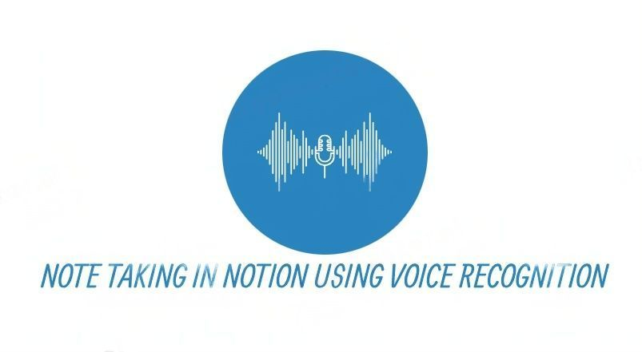
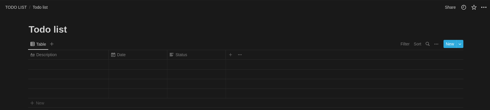

<p align="center">

  <a target="_blank">
    
  </a>
</p>
<h3 align="center">
  <b>
    <a>
      Note Taking In Notion Using Voice Recognition
    </a>
  </b>
</h3>

## Abstract
It's a note taking program using speech recognition and storing notes in Notion 

## Features 

1. can take notes or todo in `Notion App` using Voice Recognition

## Tested OS
> Ubuntu 22.04 LTS

## How to use

- for using this program you need two things
  1. Notion Internal Integration Token
  2. Notion Database Id

- You can follow this [steps](https://developers.notion.com/docs/getting-started) to create ``Notion Internal Integration Token``, ``Notion Database and Notion Database Id``
  
- After creating notion database, create 3 columns and name as `Description`, `Date` and `Status`


### Columns Type
1. Description - `Title`
2. Date - `Date`
3. Status - `Text`

- After creating the table, `EXPORT` Integration Token and database id into the `Enviorment`
```bash
export NOTION_INTEGRATION_TOKEN=your_notion_internal_integration_token
export NOTION_DATABASE_ID=your_notion_database_id
```
##### Enter these commands in your terminal by replacing `token` and `database id`

- After exporing tokens and installing the requirements, `RUN` the python program
```bash
python main.py
```

### COMMANDS

- wake up commands 
> say `friday`, `hey friday` or `hi friday`
 
- to create notes
> say `create a note for me`
